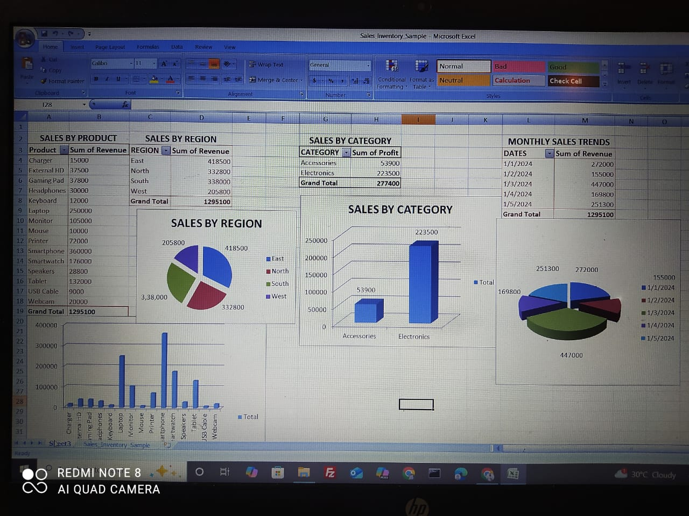

# Business-intelligence-dashboardfor-sales-and-inventory-management
This Excel project provides a comprehensive **Business Intelligence Dashboard** for tracking **sales and inventory** performance. It includes interactive charts, KPIs, and pivot tables to help you analyze business data easily.

---

## 🧩 Features

- 📈 Interactive sales and inventory dashboards
- 📊 Dynamic charts (bar, line, pie)
- 📌 Slicers for filtering by region, product, and date
- 📅 Time-based analysis (monthly, quarterly, yearly)
- 📦 Inventory tracking with reorder alerts

---

## 🗂️ Files Included

| File Name              | Description                        |
|------------------------|------------------------------------|
| `SalesDashboard.xlsx`  | Main Excel dashboard               |
| `sample-data.csv`      | Raw sales and inventory data       |
| `README.md`            | Project documentation              |
| `screenshots/`         | Preview images of the dashboard    |

---

## 🛠️ How to Use

1. **Download** or **clone** the repository.
2. Open `SalesDashboard.xlsx` in Excel.
3. Enable **macros** if prompted (for slicers to work).
4. Explore the dashboard and adjust filters as needed.

---

## 📷 Dashboard Preview

---

## 📌 Requirements

- Microsoft Excel 2016 or later (for full feature support)
- Macros enabled

---

## 📃 License

This project is licensed under the MIT License. Feel free to use, modify, and share.

---

## 🙌 Contributions

Want to improve this dashboard or suggest a new feature? Fork the repo and open a pull request!
